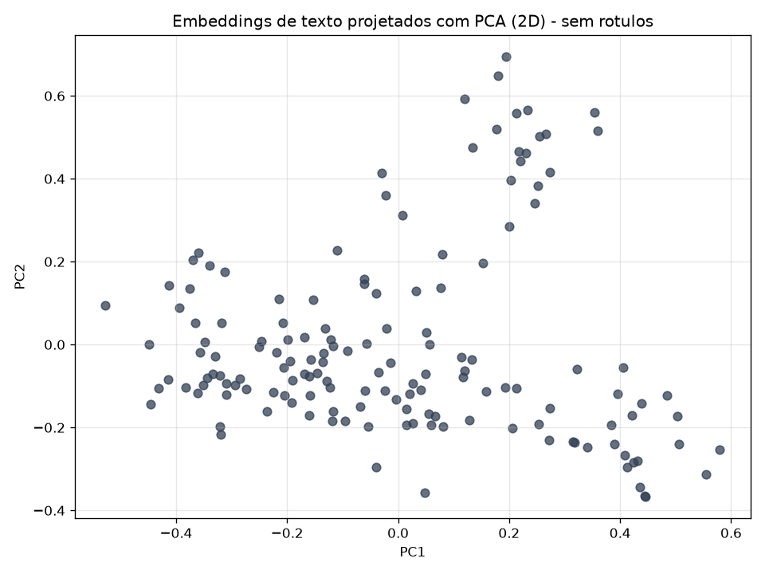
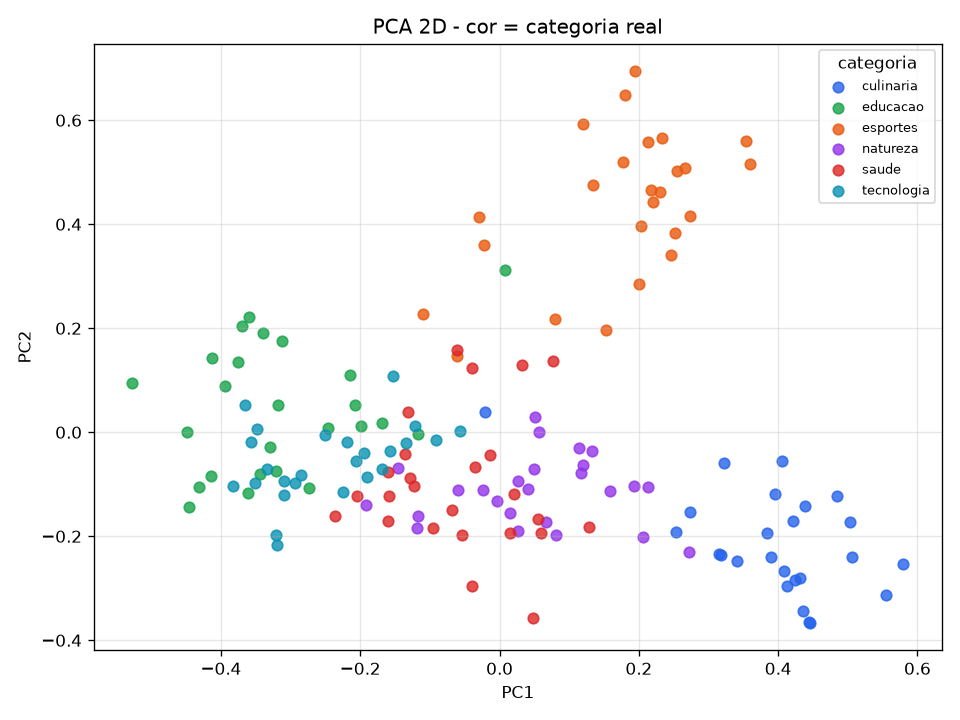
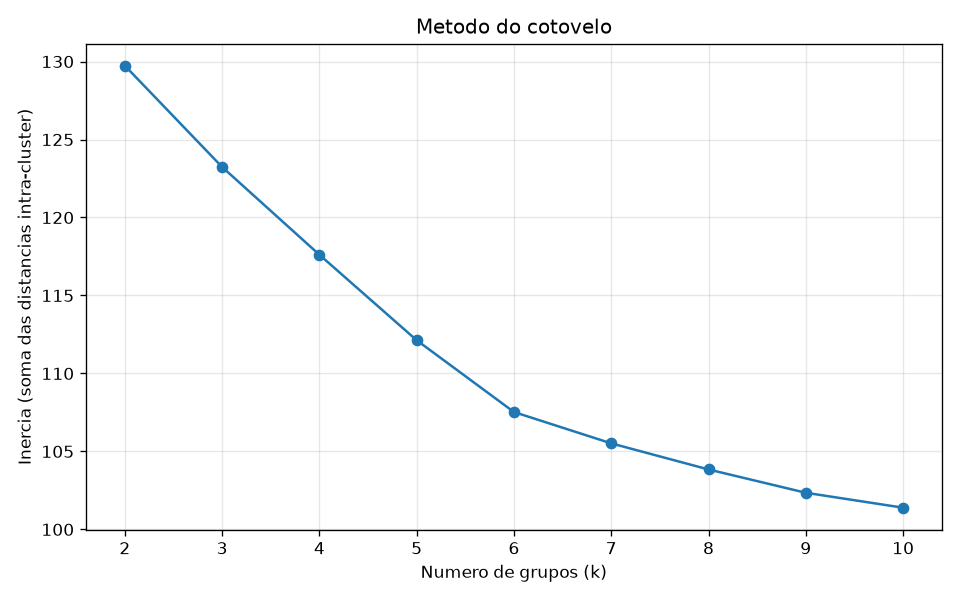
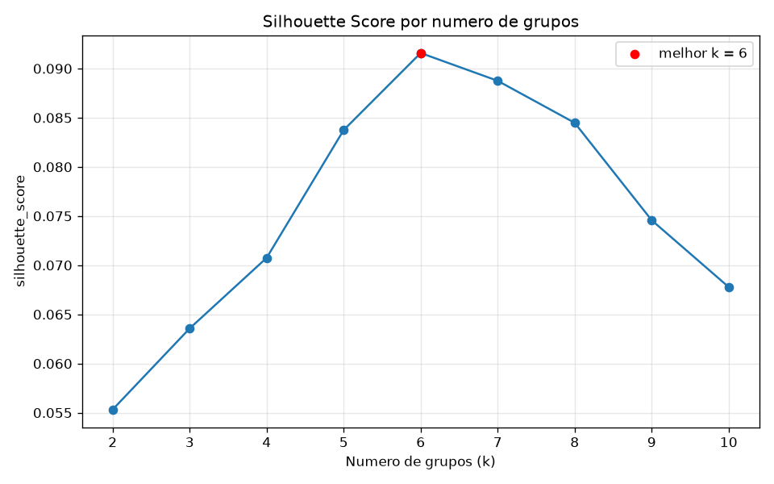
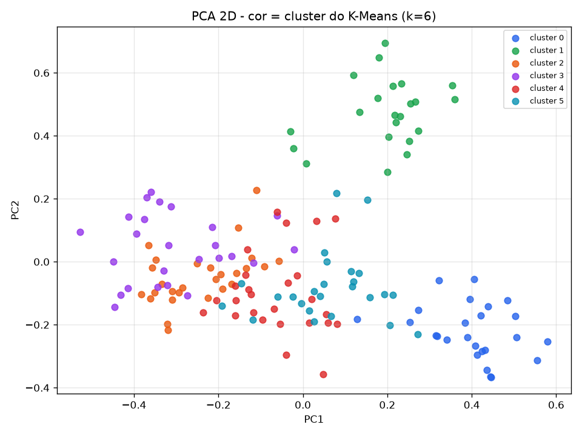
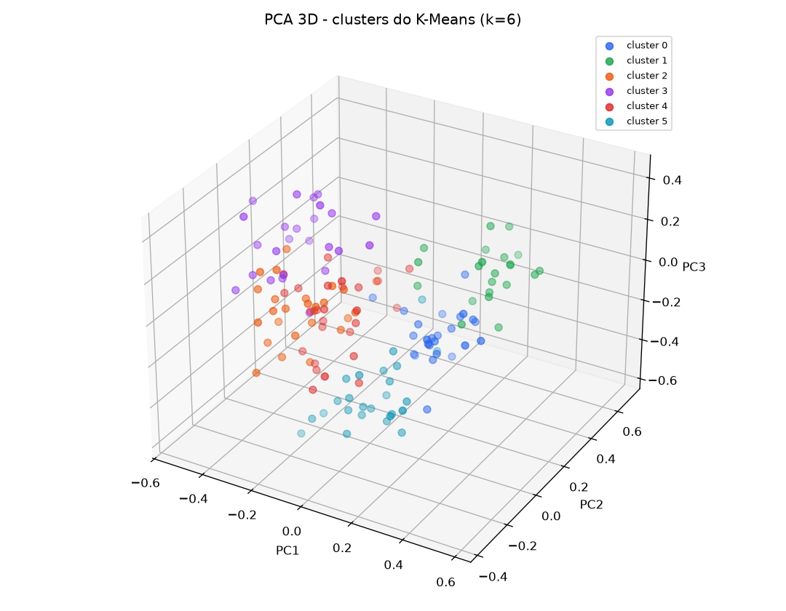

# Relatório de análise exploratória e agrupamento de dados

## Identificação

| Identificação | Preenchimento |
|---|---|
| **Integrantes** | [preencher] |
| **Título do projeto** | Agrupamento semântico de textos em português com embeddings, PCA e K-Means |
| **Tipo de dado** | ☑ Texto ☐ Imagem ☑ Base com rótulos ☐ Base sem rótulos |
| **Link do Google Colab** | [inserir URL do notebook com permissão de visualização e execução] |

> Observação sobre os rótulos: a base **possui** categorias reais, mas elas
> **não são usadas pelo K-Means** (agrupamento não supervisionado). Servem
> apenas, ao final, para avaliar a qualidade dos grupos encontrados.

---

## 1. Objetivo e pergunta de investigação

Organizar uma base de textos em português representada numericamente por um
**modelo de deep learning**, visualizar sua estrutura com **PCA em 2D e 3D** e
aplicar **K-Means** para identificar grupos, interpretando as proximidades e
caracterizando cada grupo com evidências da própria base.

**Pergunta central:** *os embeddings semânticos organizam os textos de acordo
com seus temas, de modo que um algoritmo não supervisionado (K-Means) recupere
grupos parecidos com as categorias reais?*

---

## 2. Unidade de análise e features

- **Unidade de análise:** cada linha é **um texto** (frase curta em português).
- **Base:** 150 textos, **6 categorias** temáticas com 25 textos cada:
  `tecnologia`, `esportes`, `culinaria`, `natureza`, `saude`, `educacao`.
  Gerada de forma reprodutível por `criar_dataset.py` →
  `dataset_150_textos_portugues.csv`.
- **Features:** vetor de **384 dimensões** (embedding) produzido pelo modelo
  `paraphrase-multilingual-MiniLM-L12-v2` (Sentence Transformers). É uma rede
  Transformer multilíngue; textos com sentido próximo geram vetores próximos.
- **Pré-processamento:** normalização **L2** dos embeddings (comprimento 1),
  aproximando a geometria da similaridade de cosseno.

Fluxo: **texto → Sentence Transformer → embedding (384-d) → L2 → PCA / K-Means**.

---

## 3. Qualidade dos dados

Verificação antes da análise (script `criar_dataset.py` garante a estrutura):

- **Balanceamento:** 25 textos por categoria (base perfeitamente balanceada).
- **Ausentes:** nenhum texto vazio; todas as 150 linhas têm texto e categoria.
- **Duplicatas:** não há textos repetidos.
- **Idioma:** todos em português, adequado ao modelo multilíngue escolhido.

Uma base balanceada e limpa evita que um tema domine os grupos por simples
frequência, tornando a leitura do K-Means mais justa.

---

## 4. Redução de dimensionalidade com PCA

As 384 dimensões não são observáveis diretamente. O PCA projeta os dados nas
direções de maior variância para permitir visualização.

Variância explicada pelas componentes principais:

| Componente | Variância | Acumulada |
|---|---|---|
| PC1 | 7,67% | 7,67% |
| PC2 | 6,00% | 13,67% |
| PC3 | 5,02% | 18,69% |

**Pergunta:** *duas/três dimensões descrevem toda a estrutura?* Não. Apenas
~14% (2D) e ~19% (3D) da variância aparece nas primeiras componentes — sinal de
que os embeddings têm **alta dimensão intrínseca**. Isso **não** significa
embeddings ruins: significa que a informação está distribuída por muitas
direções. Por isso o **K-Means é aplicado no espaço completo (384-d)** e o PCA
é usado só para enxergar o resultado.

### Figura 1 — Projeção PCA 2D (sem rótulos)



*Eixos: PC1 × PC2.* **Pergunta:** *há regiões de concentração antes de olhar as
classes?* Sim — mesmo sem cores, notam-se aglomerados separados por espaços
vazios, sugerindo que existe estrutura de grupos a ser descoberta.

### Figura 2 — Projeção PCA 2D colorida pela categoria real



*Eixos: PC1 × PC2; cor = categoria real.* Os temas ocupam regiões distintas do
plano. **Tecnologia** e **esportes** aparecem bem destacados; **saúde** e
**natureza** ficam mais próximos entre si (compartilham vocabulário sobre corpo,
água, vida), o que antecipa onde o K-Means pode confundir alguns textos.

---

## 5. Escolha do número de grupos (k)

O K-Means foi executado no espaço completo dos embeddings, variando `k` de 2 a
10, avaliado por dois critérios.

### Figura 3 — Método do cotovelo



*Eixos: k × inércia.* A inércia cai de forma suave, com leve inflexão em torno
de k = 6, mas o cotovelo não é agudo — comum em dados de alta dimensão.

### Figura 4 — Silhouette Score por k



*Eixos: k × silhouette_score.* A silhueta é **máxima em k = 6**
(`silhouette_score = 0,0916`), decaindo depois.

> **Número de grupos escolhido: k = 6** (maior valor de silhueta), que **coincide
> com o número real de categorias** da base. Valores absolutos baixos de silhueta
> são esperados em espaços de centenas de dimensões e não invalidam a escolha.

---

## 6. Grupos encontrados e caracterização

Aplicado o K-Means com k = 6, cada grupo foi caracterizado pela categoria
dominante, pela pureza e por exemplos reais da base.

### Figura 5 — Clusters do K-Means na projeção PCA 2D



### Figura 6 — Clusters do K-Means na projeção PCA 3D



*A terceira componente (Figura 6) separa grupos que em 2D pareciam encostados
(ex.: saúde e natureza), confirmando que parte da estrutura só aparece em mais
dimensões.*

**Caracterização de cada grupo (evidências da base):**

| Cluster | Tema dominante | Pureza | Exemplo representativo |
|---|---|---|---|
| 0 | culinária | 24/25 (96%) | "A receita leva farinha, ovos, açúcar e uma pitada de sal." |
| 1 | esportes | 21/22 (95%) | "O jogador marcou um gol incrível nos últimos minutos da partida." |
| 2 | tecnologia | 25/27 (93%) | "A inteligência artificial está transformando o mercado de software." |
| 3 | educação | 23/25 (92%) | "A professora explicou o teorema de Pitágoras no quadro." |
| 4 | saúde | 24/26 (92%) | "A vacina previne diversas doenças graves na população." |
| 5 | natureza | 23/25 (92%) | "A floresta amazônica abriga uma enorme diversidade de espécies." |

**Tabela de contingência (categoria real × cluster):**

| categoria \ cluster | 0 | 1 | 2 | 3 | 4 | 5 |
|---|---|---|---|---|---|---|
| culinaria | **24** | 0 | 0 | 1 | 0 | 0 |
| educacao | 0 | 1 | 1 | **23** | 0 | 0 |
| esportes | 0 | **21** | 1 | 1 | 0 | 2 |
| natureza | 0 | 0 | 0 | 0 | 2 | **23** |
| saude | 1 | 0 | 0 | 0 | **24** | 0 |
| tecnologia | 0 | 0 | **25** | 0 | 0 | 0 |

A diagonal concentra quase todos os textos: cada categoria caiu majoritariamente
num único cluster. Concordância global medida pelo **Adjusted Rand Index =
0,8456** (0 = aleatório, 1 = perfeito), indicando forte alinhamento entre os
grupos não supervisionados e os temas reais.

**Textos agrupados de forma inesperada (análise semântica):** os poucos erros
têm explicação de conteúdo, não de acaso. Ex.: "O ciclista liderou a etapa nas
montanhas" (esportes) caiu em *natureza* pela menção a montanhas; frases de
saúde sobre "água limpa/poluição" tangenciam *natureza*. São ambiguidades
semânticas reais, não ruído do método.

---

## 7. Hipótese sobre separabilidade e conclusão

**Hipótese confirmada:** os embeddings do modelo multilíngue organizam os textos
por tema, e o K-Means recupera 6 grupos que correspondem às 6 categorias reais
(ARI = 0,85; pureza de 92–96%). A escolha de k por silhueta apontou exatamente o
número correto de temas.

**Cluster ≠ classe:** o K-Means agrupa por proximidade geométrica, não por
rótulo; por isso textos ambíguos migram para o grupo do tema mais próximo em
significado — o que é informativo sobre a base, não um defeito.

---

## 8. Limitações

- Base pequena e de frases curtas; textos mais longos e variados podem reduzir a
  pureza.
- PCA 2D/3D mostra pouca variância (~14–19%): a visualização é uma **aproximação**
  e pode sugerir sobreposições que não existem no espaço completo.
- O valor absoluto da silhueta é baixo (efeito da alta dimensão); ele foi usado
  de forma **comparativa** entre valores de k, o que é adequado.

---

## 9. Reprodutibilidade

```bash
pip install -r requirements.txt
python criar_dataset.py    # gera dataset_150_textos_portugues.csv (opcional; main gera se faltar)
python main.py             # embeddings, PCA, K-Means, figuras e resultados
```

Saídas: figuras em `figuras/`; `resultados/atribuicoes.csv`,
`resultados/crosstab_categoria_cluster.csv` e `resultados/resumo.txt`.

## Referências

- Sentence Transformers — `paraphrase-multilingual-MiniLM-L12-v2`
  (https://huggingface.co/sentence-transformers/paraphrase-multilingual-MiniLM-L12-v2).
- Pedregosa et al. — scikit-learn: PCA, KMeans, silhouette_score, adjusted_rand_score.
