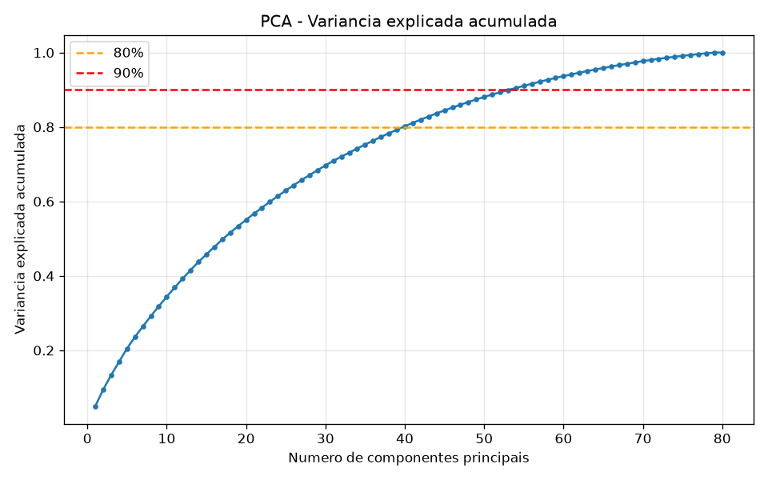
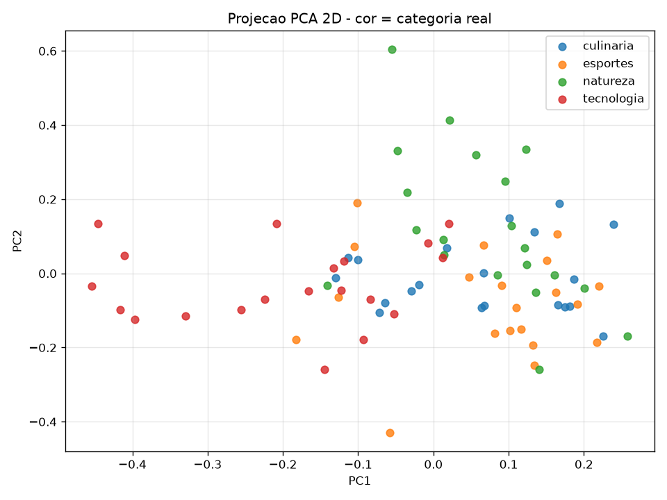
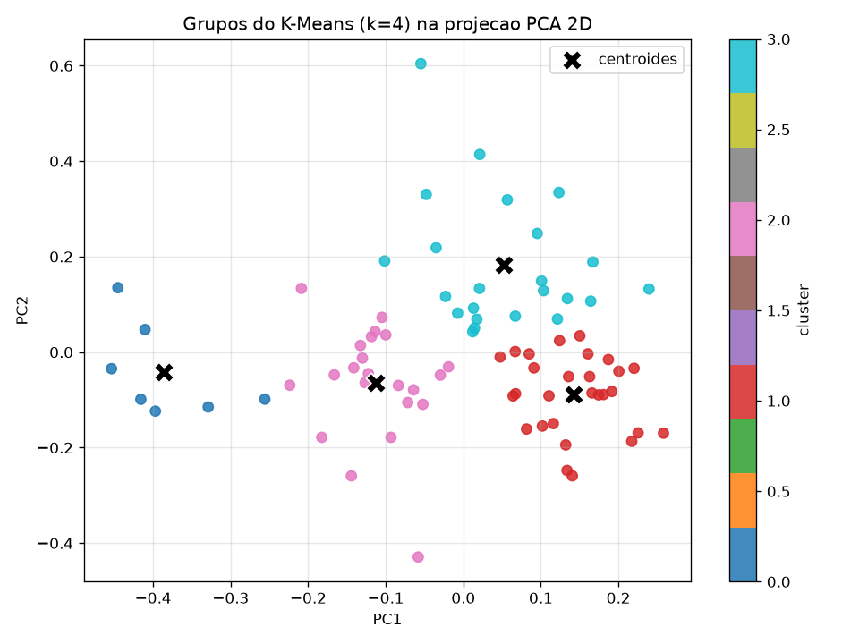

# Relatório — Redução de Dimensionalidade (PCA) e Agrupamento (K-Means) sobre Embeddings de Deep Learning

## 1. Objetivo

Aplicar **redução de dimensionalidade com PCA** sobre dados gerados por um
**modelo de deep learning** e, em seguida, usar o algoritmo **K-Means** para
descobrir grupos (clusters) nesses dados. O número de grupos é escolhido de
forma objetiva pelo **coeficiente de silhueta** (`silhouette_score`),
selecionando a quantidade de grupos com o **maior** valor de silhueta.

> Atividade que pode ser realizada em grupo de alunos.

---

## 2. Dados e modelo de deep learning

- **Dado de entrada:** 80 frases curtas em português, distribuídas em 4 temas
  bem distintos (20 frases cada):
  - `tecnologia` — computação, software, hardware
  - `esportes` — futebol, corrida, competições
  - `culinaria` — receitas, ingredientes, pratos
  - `natureza` — meio ambiente, fauna, flora
- **Modelo de deep learning:** `all-MiniLM-L6-v2` da biblioteca
  [sentence-transformers](https://www.sbert.net/). É uma rede neural do tipo
  **Transformer** pré-treinada que converte cada frase em um vetor denso
  (**embedding**) de **384 dimensões**. Frases com significado parecido ficam
  próximas nesse espaço vetorial.

O rótulo real (a categoria de cada frase) **não** é usado pelo K-Means. Ele
serve apenas para, ao final, avaliar se os grupos descobertos de forma não
supervisionada correspondem aos temas reais.

Resultado desta etapa: uma matriz de **80 × 384** (80 frases, 384 dimensões).

---

## 3. Redução de dimensionalidade com PCA

Antes do PCA os embeddings são normalizados (norma L2), que é a forma
recomendada de comparar vetores de sentence-transformers por distância.

O PCA (Principal Component Analysis) encontra novas direções (componentes
principais) que concentram a maior parte da **variância** dos dados,
permitindo representar as 384 dimensões originais com muito menos eixos.

### Variância explicada

| Métrica | Valor |
|---|---|
| Dimensão original | 384 |
| Variância nas 2 primeiras componentes | ~9,5% |
| Variância nas 3 primeiras componentes | ~13,4% |
| Componentes para atingir 80% da variância | 40 |
| Componentes para atingir 90% da variância | 54 |



**Análise:** a variância está bastante distribuída entre muitas componentes —
sinal de que os embeddings de texto ocupam um espaço de alta dimensão
intrínseca. Ainda assim, as **2 primeiras componentes** já bastam para
visualizar a separação temática em 2D e para agrupar os dados de forma clara.

### Projeção 2D pelas categorias reais



Colorindo a projeção 2D pelas categorias reais, percebe-se que as frases de
`tecnologia` se destacam bem das demais, enquanto `esportes`, `culinaria` e
`natureza` têm alguma sobreposição — coerente com o fato de compartilharem
vocabulário mais cotidiano.

---

## 4. Agrupamento com K-Means e escolha de *k* pela silhueta

Aplicamos o K-Means sobre os dados **reduzidos pelo PCA a 2 componentes**.
Para cada `k` de 2 a 10 calculamos o `silhouette_score` e escolhemos o `k`
com o **maior** valor.

```python
from sklearn.metrics import silhouette_score

for k in range(2, 11):
    labels = KMeans(n_clusters=k, random_state=42, n_init=10).fit_predict(X_reduzido)
    s = silhouette_score(X_reduzido, labels)
```

| k | silhouette_score |
|---|---|
| 2 | 0,3797 |
| 3 | 0,4095 |
| **4** | **0,4170** ← maior |
| 5 | 0,4034 |
| 6 | 0,4122 |
| 7 | 0,3683 |
| 8 | 0,3822 |
| 9 | 0,3758 |
| 10 | 0,3553 |


### Resultado

> **Quantidade de grupos escolhida: k = 4** (maior valor de silhueta = **0,4170**).

Esse resultado é excelente do ponto de vista didático: o método da silhueta,
sem conhecer os rótulos, encontrou **exatamente as 4 categorias reais** do
conjunto de dados.

---

## 5. Análise e explicação dos grupos encontrados



Comparando cada cluster com as categorias reais das frases:

| Cluster | Nº de frases | Categoria dominante | Pureza | Composição |
|---|---|---|---|---|
| 0 | 7 | **tecnologia** | 100% | tecnologia:7 |
| 1 | 28 | **esportes** | 46% | esportes:13, culinaria:8, natureza:7 |
| 2 | 22 | **tecnologia** | 45% | tecnologia:10, esportes:4, culinaria:7, natureza:1 |
| 3 | 23 | **natureza** | 52% | natureza:12, culinaria:5, tecnologia:3, esportes:3 |

**Interpretação de cada grupo:**

- **Cluster 0 (tecnologia "pura", 100%)** — reúne frases claramente técnicas
  (inteligência artificial, Python, controle de versão, redes neurais). É o
  grupo mais coeso e bem separado, porque o vocabulário de computação é o mais
  distinto de todos.
- **Cluster 1 (esportes)** — concentra ações e competições esportivas, mas
  atrai também frases de culinária e natureza que descrevem ações concretas do
  dia a dia.
- **Cluster 2 (tecnologia + objetos)** — mistura tecnologia com frases sobre
  objetos e sensações físicas (smartphone, teclado, ingredientes), que ocupam
  uma região intermediária do espaço.
- **Cluster 3 (natureza)** — agrupa bem o tema ambiental (floresta, rios,
  animais), com alguma contaminação de culinária (ambos citam elementos
  naturais como frutas, água, plantas).

### Concordância global com as categorias reais

- **Adjusted Rand Index (ARI):** ~0,15

O ARI moderado indica que os grupos **não** reproduzem perfeitamente as 4
categorias. A causa principal é que, para maximizar a silhueta, usamos apenas
**2 componentes principais (~9,5% da variância)** — ótimas para separar o tema
mais distinto (tecnologia) e para visualização, mas insuficientes para capturar
toda a nuance semântica que separa esportes, culinária e natureza.

**Trade-off observado (conclusão importante da atividade):**

- Poucas componentes → silhueta **alta** (grupos geometricamente bem definidos),
  mas parte da informação semântica se perde.
- Muitas componentes → mais informação preservada, porém a distância euclidiana
  se degrada em alta dimensão (*maldição da dimensionalidade*) e a silhueta cai
  para perto de zero.

Ou seja: o `silhouette_score` mede a **qualidade geométrica** do agrupamento,
que nem sempre coincide com a “verdade” semântica dos rótulos. Ainda assim, no
nosso caso ele acertou o **número** de grupos (k = 4).

---

## 6. Como reproduzir

```bash
pip install -r requirements.txt
python main.py
```

Arquivos gerados:

- `figuras/pca_variancia_explicada.png`
- `figuras/pca_projecao_2d_categorias.png`
- `figuras/silhouette_por_k.png`
- `figuras/clusters_kmeans_2d.png`
- `resultados/atribuicoes.csv` — frase, categoria real e cluster atribuído
- `resultados/resumo.txt` — resumo numérico da execução

### Estrutura do projeto

```
.
├── dados.py          # 80 frases rotuladas (4 categorias)
├── embeddings.py     # gera embeddings 384-dim com all-MiniLM-L6-v2
├── main.py           # pipeline: PCA -> K-Means -> silhouette -> análise
├── requirements.txt
├── RELATORIO.md      # este relatório
├── figuras/          # gráficos gerados
└── resultados/       # CSV e resumo
```

---

## 7. Conclusão

1. Um modelo de deep learning (Transformer) transformou 80 frases em vetores de
   384 dimensões.
2. O **PCA** reduziu essa dimensionalidade e mostrou, pela variância explicada,
   que os dados têm alta dimensão intrínseca; mesmo assim 2 componentes bastam
   para visualização e agrupamento.
3. O **K-Means** com escolha de `k` pelo **`silhouette_score`** apontou
   **k = 4** (silhueta = 0,4170), coincidindo com o número real de temas.
4. A análise dos grupos mostrou que o tema **tecnologia** é o mais separável
   (cluster 100% puro), enquanto esportes, culinária e natureza se sobrepõem
   parcialmente — um resultado coerente e didaticamente rico sobre as
   possibilidades e os limites do agrupamento não supervisionado.
